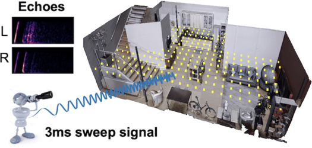

## VisualEchoes: Spatial Image Representation Learning through Echolocation
This repository contains the RGB / Depth / Echo data used for spatial image representations learning in our ECCV 2020 paper [VisualEchoes](https://arxiv.org/abs/2005.01616). [[Project Page]](http://vision.cs.utexas.edu/projects/visualEchoes/)



<br/>

[VisualEchoes: Spatial Image Representation Learning through Echolocation](https://arxiv.org/abs/2005.01616)  
 [Ruohan Gao](https://www.cs.utexas.edu/~rhgao/)<sup>1,3</sup>,  [Changan Chen](https://changan.io/)<sup>1,3</sup>,  [Ziad Al-Halah](https://www.cs.utexas.edu/~ziad/)<sup>1</sup>, [Carl Schissler](https://scholar.google.com/citations?user=YcL_y8AAAAAJ&hl=en)<sup>2</sup>, [Kristen Grauman](http://www.cs.utexas.edu/~grauman/)<sup>1,3</sup> <br/>
 <sup>1</sup>UT Austin, <sup>2</sup>Facebook Reality Lab, <sup>3</sup>Facebook AI Research  
 In European Conference on Computer Vision (**ECCV**), 2020  
 
<br/>

If you find our data or project useful in your research, please cite:

    @inproceedings{gao2020visualechoes,
      title = {VisualEchoes: Spatial Image Representation Learning through Echolocation},
      author = {Gao, Ruohan and Chen, Changan and Al-Halab, Ziad and Schissler, Carl and Grauman, Kristen},
      booktitle = {ECCV},
      year = {2020}
    }

### Demo Video of Echolocation Simulation
We show an example of the agent navigating in one replica scene and performing echolocation. The agent emits 3ms chirp signals from 20Hz to 20kHz and receives echo responses from the room. Echoes resulting from the emitted chirps reflect the scene geometry.

[](https://youtu.be/MobPvUf6F20)

### Overview of VisualEchoes Dataset
We provide the (RGB, Depth, Echo) data generated using [habitat-sim](https://github.com/facebookresearch/habitat-sim) and [sound-spaces](https://github.com/facebookresearch/sound-spaces) on [Replica](https://github.com/facebookresearch/Replica-Dataset) dataset.  The source audio "chirp" we use is a sweep signal from 20Hz - 20kHz (the human-audible range) within a duration of 3ms (3ms_sweep.wav). The echoes are obtained by convolving the 1s audio (with the sweep signal in the first 3ms) with the corresponding binaural echolocation room impuse responses (RIRs) for each of the four orientations (0&deg;, 90&deg;, 180&deg;, 270&deg;) at the agents' locations. When the agent emits sound from its position, convolving the emitted omnidirectional audio with the corresponding binaural RIR generates the binaural echo responses from the environment the agent hears when facing each orientation.

### Data Download
1. The VisualEchoes dataset contains the RGB images, depth maps, echo responses generated from Replica dataset. Run the commands below to download the rgb-depth pairs (4 different resolutions), echoes, room impuse responses used for echolocation for the 1,740 navigable locations x 4 orientations = 6,960 agent states used in the paper. 
```
# rgb-depth pairs of 4 different resolutions
# dictionary is in the format of {scene:{(location, orientation): {'rgb':rgb_image, 'depth':depth_map}}}
wget http://dl.fbaipublicfiles.com/VisualEchoes/rgb_depth/scene_observations_128.pkl
wget http://dl.fbaipublicfiles.com/VisualEchoes/rgb_depth/scene_observations_140.pkl
wget http://dl.fbaipublicfiles.com/VisualEchoes/rgb_depth/scene_observations_256.pkl
wget http://dl.fbaipublicfiles.com/VisualEchoes/rgb_depth/scene_observations_280.pkl

# echo responses for the 3ms sweep signal at all navigable locations
#    ├── echoes_navigable                          
#    │       └── [scene]                         (scene name)
#    │           └── [sweep_sound]               (name of the source signal)
#    │               └── [angle]                 (agent's orientation)
#    │                   └── location_index.wav  (agent's location)
wget http://dl.fbaipublicfiles.com/VisualEchoes/echoes_navigable.tar.gz

# echolocation room impulse response for all navigable locations
#    ├── echolocation_RIRs_navigable                          
#    │       └── [scene]                         (scene name)
#    │           └── [angle]                     (agent's orientation)
#    │               └── location_index.wav      (agent's location)
wget http://dl.fbaipublicfiles.com/VisualEchoes/echolocation_RIRs_navigable.tar.gz
```

2. We also provide the echoes and binaural echolocation room impulse responses for all locations of the 18 environments in Replica.
```
# echo responses for the 3ms sweep signal at all locations
wget http://dl.fbaipublicfiles.com/VisualEchoes/echoes_all.tar.gz

# echolocation room impulse response for all locations
wget http://dl.fbaipublicfiles.com/VisualEchoes/echolocation_RIRs_all.tar.gz
```

### Echolocation
The data/sweep_audio/ directory contains the 3ms sweep signal we use for echolocation in our paper as well as some other types of sweep signals. To generate echo responses for other types of 1s signals of your choice, place the directory of echolocation room impluse response properly under your data directory and use the getEchoes.py script to perform echolocation.
```
python getEchoes.py
```


### Acknowlegements
The RGB and depth data are generated using [habitat-sim](https://github.com/facebookresearch/habitat-sim) on [Replica](https://github.com/facebookresearch/Replica-Dataset) dataset. The binaural RIRs we use for echolocation is a subset of the binaural RIRs from [sound-spaces](https://github.com/facebookresearch/sound-spaces).

### Licence
The VisualEchoes dataset is CC BY 4.0 licensed, as found in the LICENSE file.
